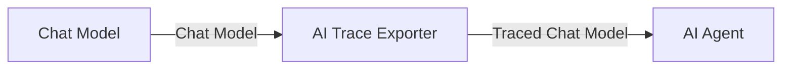
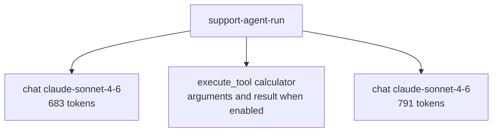

# n8n-nodes-observability

OpenTelemetry tracing for n8n AI Agent workflows.

The **AI Trace Exporter** is a passthrough sub-node inserted between a Chat Model
and the AI Agent. Each agent execution is exported as one OTLP/HTTP JSON trace:
one span per LLM call (model, token usage, latency, errors; prompts and
completions opt-in) plus reconstructed tool-call spans. Compatible backends:
Comet Opik, Langfuse, any OTLP/HTTP JSON collector, and Datadog through an
OpenTelemetry Collector. The package has no runtime dependencies and does not
modify the model or agent nodes.

## What a trace looks like

One trace per agent execution (n8n execution ID), named after the **Trace Name**
parameter:

Spans use OTel GenAI semantic-convention attributes; backends that map them
(e.g. Opik) derive model, provider, per-call token usage, and cost from the
attributes directly.

## Installation

**Self-hosted n8n:** Settings → Community Nodes → Install → `n8n-nodes-observability`.

Requires n8n with AI (LangChain) nodes available. No external services beyond
your observability backend.

## Setup

1. Add the **AI Trace Exporter** node between your Chat Model and your AI Agent
   (both connections are the model type — the node is a passthrough).
2. Create an **OTLP Trace Exporter API** credential:

| Backend                    | Endpoint URL                                            | Credential fields                                                   | Behavior                                                                     |
| -------------------------- | ------------------------------------------------------- | ------------------------------------------------------------------- | ---------------------------------------------------------------------------- |
| Langfuse Cloud             | Your region's OTLP/HTTP base endpoint                   | Public key and secret key                                           | Uses Basic Auth and sends `x-langfuse-ingestion-version: 4`                  |
| Opik Cloud                 | `https://www.comet.com/opik/api/v1/private/otel`        | API key, workspace, optional project                                | Sends `Authorization`, `Comet-Workspace`, and optional `projectName` headers |
| Datadog via OTLP Collector | Your collector's OTLP/HTTP JSON endpoint                | Collector receiver auth, if required                                | Configure the Datadog exporter with your Datadog site and API key            |
| Generic OTLP               | Any OTLP/HTTP JSON endpoint, including self-hosted Opik | Backend default (none), Basic Auth, API key header, or headers only | Adds only the authentication and headers you configure                       |

This node emits OTLP/HTTP JSON. For Datadog, point it at an OpenTelemetry
Collector configured with the Datadog exporter.

**Additional Headers** are applied after the preset and primary auth for every
auth mode. This supports proxies and self-hosted routing, and intentionally
allows an advanced configuration to override a preset header.

> The credential's **Test** button POSTs an empty OTLP payload
> (`{"resourceSpans":[]}`) to `<endpoint>/v1/traces` — the same URL the
> exporter uses — so a reachable backend with valid auth answers 2xx and the
> test passes. No spans are ingested by the test.

3. Optionally set **Trace Name** (names the trace in your backend),
   **Session ID** and **User ID** (expression-friendly — e.g. reference a chat
   session), and **Metadata**.

**Session/thread grouping:** Session ID is exported under the keys each
backend natively groups on — `thread_id` and `gen_ai.conversation.id` (Opik
picks up either as the trace's thread, so executions sharing a Session ID
appear as one conversation under Opik's _Threads_), and `session.id` /
`langfuse.session.id` (Langfuse _Sessions_). User ID is likewise exported as
`user.id` and `langfuse.user.id` (Langfuse _Users_). Set Session ID to a chat
session key (e.g. `{{ $json.sessionId }}`) to get per-conversation grouping.

## Options

| Option                                           | Default | Notes                                                                                      |
| ------------------------------------------------ | ------- | ------------------------------------------------------------------------------------------ |
| Include Prompts and Responses                    | **off** | Full prompt/response content in spans. Content does not leave the instance unless enabled. |
| Include Tool Inputs and Outputs                  | **off** | Arguments and results on reconstructed tool spans.                                         |
| Privacy Options → Max Captured Content Size (KB) | 32      | Captured content is truncated before export.                                               |
| Privacy Options → Redaction Patterns             | —       | JavaScript regexes (raw or `/pattern/flags`); matches become `[REDACTED]` before export.   |
| Trace Attributes → Environment                   | —       | Searchable deployment environment (`deployment.environment.name`, Langfuse environment).   |
| Trace Attributes → Release                       | —       | Searchable release/deployment version.                                                     |
| Trace Attributes → Service Name                  | `n8n`   | OTel `service.name` resource attribute.                                                    |
| Trace Attributes → Tags                          | —       | Searchable trace labels, including Langfuse-native trace tags.                             |
| Export Options → Sampling Rate (%)               | 100     | Percentage of traces queued for export.                                                    |

**Failure policy:** export is asynchronous. A slow or unreachable backend does
not fail the workflow. Background HTTP failures are logged; configuration
problems and queue overflow are also added to the n8n execution as warnings.

## What is captured (and what isn't)

Captured per LLM call: requested/resolved model, provider, request controls,
response ID/finish reason, input/output token usage, latency, errors, and — only
when enabled — prompts, completions, and model-side tool-call decisions. All
spans carry n8n context (`n8n.workflow.id/name`, `n8n.execution.id`,
`n8n.node.id/name/type`, item index) plus your session/user/metadata,
environment, release, and tags.

The AI Trace Exporter also reports model start/end/error through n8n's sub-node
execution API. It therefore turns green when the connected agent actually
invokes the model. Sampled runs expose `traceId`, `rootSpanId`, and a truthful
`exportStatus: queued`; unsampled runs expose `exportStatus: notSampled` and no
correlation IDs. Prompt and response content is never duplicated into this n8n
execution-state payload.

Redaction applies before payloads leave the process, including error messages
and searchable metadata—not only prompt text. Invalid regexes are ignored and
reported by count without logging the pattern itself. Prompt/completion and
tool I/O capture remain off by default.

Tool _executions_ (the actual Calculator/HTTP/etc. runs between LLM calls) are
not visible to a model-attached tracer in n8n's current architecture.
`execute_tool <name>` spans are therefore reconstructed from what does pass
through the model: the tool calls the model requested, matched to the results
echoed back in the next model call. This includes n8n V3's fallback
`Calling <tool> with input: <JSON>` message when a provider callback omits
structured `tool_calls` (all reconstructed spans are marked
`n8n.span.synthesized: true`). Their
timing is derived from the surrounding LLM-call boundaries and includes n8n
framework overhead, not pure tool runtime. A tool whose result never reaches a
later model call (e.g. an error mid-tool) is still emitted at execution end,
marked `n8n.tool.result_observed: false` and without output — as are id-less
tool calls, which can't be matched to their results even when one did flow
through a later model call. Tool input/output payloads are only captured with
**Include Tool Inputs and Outputs** enabled. Engine-level tool spans (exact timing, engine
visibility) depend on an n8n-core extension point.

## Compatibility

Tested against n8n 2.29 with the AI Agent (Tools Agent) and Anthropic/OpenAI
chat models; any Chat Model sub-node should work — the tracer attaches at the
LangChain callback level and contains no provider-specific code. Requires
Node.js ≥ 22.22 on self-hosted instances.

## Roadmap

- Score / feedback and dataset-item operations
- Engine-level tool spans with exact timing (requires an n8n-core extension point)
- Export retry/backoff, batching, compression, and explicit flush diagnostics
- Multi-destination fan-out

## License

[MIT](LICENSE)
