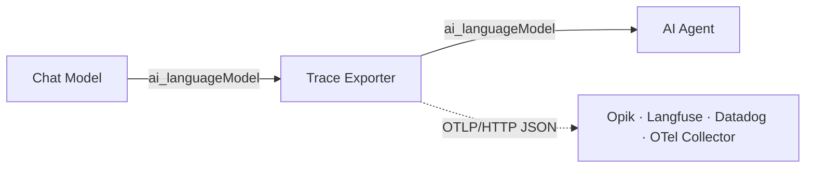
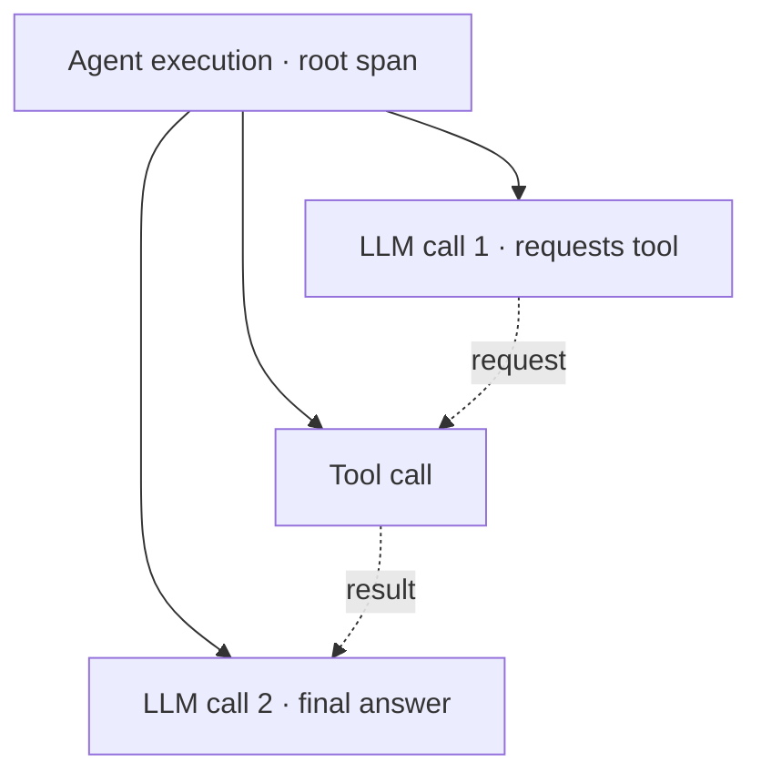

# n8n-nodes-observability

An n8n community node that exports AI Agent executions as OpenTelemetry traces.
The Trace Exporter is a passthrough sub-node between a Chat Model and an AI
Agent. It does not replace either node and has no runtime dependencies.



## Installation

In self-hosted n8n, open **Settings → Community Nodes → Install** and enter:

```text
n8n-nodes-observability
```

Requires n8n with AI/LangChain nodes and Node.js 22.22 or newer.

## Setup

1. Connect the Chat Model to the Trace Exporter.
2. Connect the Trace Exporter to the AI Agent.
3. Create an **OTLP Exporter API** credential.
4. Test the credential, then run the workflow.

Both node connections must use `ai_languageModel`.

### Credentials

| Backend           | Endpoint                                         | Authentication                      |
| ----------------- | ------------------------------------------------ | ----------------------------------- |
| Comet Opik Cloud  | `https://www.comet.com/opik/api/v1/private/otel` | API Key Header: `Authorization`     |
| Opik self-hosted  | `http://<host>:5173/api/v1/private/otel`         | None or custom headers              |
| Langfuse Cloud    | `https://cloud.langfuse.com/api/public/otel`     | Basic Auth: public key / secret key |
| Datadog           | `https://otlp-http-intake.logs.<site>/v1/traces` | API Key Header: `dd-api-key`        |
| Generic collector | OTLP/HTTP base URL                               | Collector-specific                  |

The presets add these headers:

| Preset   | Headers                                          |
| -------- | ------------------------------------------------ |
| Opik     | `Comet-Workspace`, `projectName` when configured |
| Langfuse | `x-langfuse-ingestion-version: 4`                |
| Datadog  | `dd-otlp-source: llmobs`, `dd-ml-app`            |
| Custom   | None                                             |

**Additional Headers** are applied after preset and authentication headers and
can override them.

The credential test sends an empty OTLP request to `<endpoint>/v1/traces`. It
checks connectivity and authentication without creating a span.

## Trace structure

One n8n workflow execution produces one trace. A trace contains a synthetic
root span and one child span for each model or reconstructed tool call.



A backend's flat span or “LLM Calls” table shows these as four rows. They still
belong to one trace and one n8n execution. A run without tools normally contains
the root and one LLM span.

The Trace Exporter reports model start, end, and error through n8n's sub-node
execution API. It turns green when the agent invokes the model. Its execution
data includes the exported `traceId` and root `spanId`.

## Captured data

Each LLM span can include:

- requested and resolved model;
- provider and GenAI operation;
- input and output token usage;
- request parameters exposed by the provider callback;
- response ID, finish reason, duration, and error;
- OTel exception events for failures.

Every span also carries workflow, execution, node, item, session, user,
environment, release, tag, and custom metadata where configured.

Prompt, completion, and tool payloads are disabled by default:

| Option                      | Default | Data added                                               |
| --------------------------- | ------: | -------------------------------------------------------- |
| Capture Prompts/Completions |     Off | Model input and output messages                          |
| Capture Tool I/O            |     Off | Tool arguments and results visible to the model callback |

n8n execution-state data never includes prompt or completion content.

## Node options

| Option                | Default | Description                                               |
| --------------------- | ------: | --------------------------------------------------------- |
| Environment           |       — | Deployment environment                                    |
| Max Payload Size (KB) |    `32` | Maximum captured payload size before truncation           |
| Redaction Patterns    |       — | JavaScript regular expressions replaced with `[REDACTED]` |
| Release               |       — | Application or deployment version                         |
| Sampling Rate (%)     |   `100` | Percentage of traces exported                             |
| Service Name          |   `n8n` | OTel `service.name`                                       |
| Tags                  |       — | Trace labels                                              |

Redaction accepts raw expressions such as `\b\d{16}\b` and delimited
expressions such as `/secret-[a-z0-9]+/gi`. It is applied before export to
captured prompts, completions, tool payloads, errors, tags, and metadata.
Invalid expressions are ignored and logged by count without logging the
expression itself.

## Correlation attributes

Set **Session ID** to a conversation key such as `{{ $json.sessionId }}` to
group several workflow executions.

| Purpose          | Attributes                                     |
| ---------------- | ---------------------------------------------- |
| Opik thread      | `thread_id`, `gen_ai.conversation.id`          |
| Langfuse session | `session.id`, `langfuse.session.id`            |
| Langfuse user    | `user.id`, `langfuse.user.id`                  |
| Custom metadata  | `n8n.metadata` and flattened searchable fields |

## Tool spans

n8n's model callback does not expose tool-node execution directly. The Trace
Exporter reconstructs a tool span from the model's tool request and the result
included in the next model call.

Reconstructed spans have `n8n.span.synthesized = true`. Their timing covers the
interval between model callbacks and can include n8n overhead. If no later tool
result is observed, the span is emitted without output and with
`n8n.tool.result_observed = false`.

Exact tool-node timing requires an n8n-core extension point.

## Export behavior

- Export is asynchronous and does not fail the workflow.
- HTTP requests have a bounded timeout.
- The in-memory span queue is bounded.
- Failed exports are logged as warnings.
- Prompt/completion and tool payload capture are off by default.

Retry with backoff, compression, explicit flush diagnostics, and
multi-destination fan-out are not implemented.

## Compatibility

Tested with n8n 2.29's AI Agent/Tools Agent and Anthropic/OpenAI chat models.
The tracer attaches through LangChain callbacks and does not import a provider
SDK at runtime.

Score/feedback and dataset-item operations are not shipped.

## License

[MIT](LICENSE)
