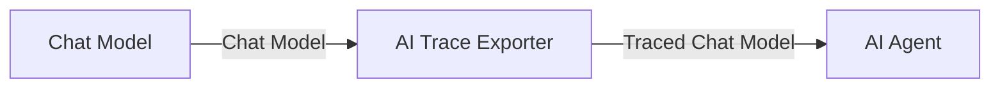
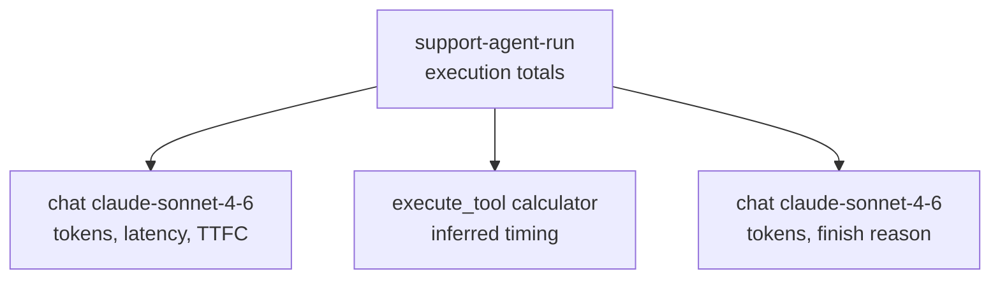

# n8n-nodes-observability

OpenTelemetry tracing for n8n AI Agent workflows.

The **AI Trace Exporter** is a passthrough sub-node between a Chat Model and an
AI Agent. It exports OTLP/HTTP JSON to Comet Opik, Langfuse, or a generic
OpenTelemetry collector. Datadog is supported through an OpenTelemetry
Collector. The package has no runtime dependencies and does not modify the
model or agent nodes.

_The exporter sits between the Chat Model and AI Agent and turns green when the model runs._

## Trace structure

Each agent invocation gets a synthetic root span, one child span per model
call, and reconstructed tool spans:

_One agent invocation in Opik: two model calls and the reconstructed Calculator call in one trace._

The root carries call, tool, and error counts plus input, output, cache-read,
cache-creation, and reasoning-token totals when the provider reports them.
Model spans include normalized provider/model names, request controls,
response metadata, token details, latency, streaming state, and time to first
chunk. Backends can derive per-call cost from the model and token attributes;
the node does not maintain a pricing table.

## Installation

On self-hosted n8n, open **Settings → Community Nodes → Install** and enter
`n8n-nodes-observability`.

The node requires n8n's AI nodes and Node.js 22.22 or newer. It sends data only
to the OTLP endpoint configured in its credential.

## Setup

1. Connect a Chat Model to the **AI Trace Exporter**, then connect the
   exporter's output to an AI Agent.
2. Create an **OTLP Trace Exporter API** credential.

| Backend                    | Endpoint URL                                            | Credential fields                                                   | Behavior                                                                     |
| -------------------------- | ------------------------------------------------------- | ------------------------------------------------------------------- | ---------------------------------------------------------------------------- |
| Langfuse Cloud             | Your region's OTLP/HTTP base endpoint                   | Public key and secret key                                           | Uses Basic Auth and sends `x-langfuse-ingestion-version: 4`                  |
| Opik Cloud                 | `https://www.comet.com/opik/api/v1/private/otel`        | API key, workspace, optional project                                | Sends `Authorization`, `Comet-Workspace`, and optional `projectName` headers |
| Datadog via OTLP Collector | Your collector's OTLP/HTTP JSON endpoint                | Collector receiver auth, if required                                | Configure the Datadog exporter with your Datadog site and API key            |
| Generic OTLP               | Any OTLP/HTTP JSON endpoint, including self-hosted Opik | Backend default (none), Basic Auth, API key header, or headers only | Adds only the authentication and headers you configure                       |

**Additional Headers** are applied after the preset and primary auth. This
supports authenticated proxies and allows an explicit header to override a
preset value.

The credential's **Test** button POSTs an empty OTLP payload
(`{"resourceSpans":[]}`) to `<endpoint>/v1/traces`. The request checks the same
URL and authentication used by the exporter without ingesting a span.

3. Set **Trace Name** if needed. **Session ID**, **User ID**, and **Metadata**
   are expression-friendly.

Session ID is exported as `gen_ai.conversation.id`, `thread_id`, `session.id`,
and `langfuse.session.id`. User ID is exported as `user.id` and
`langfuse.user.id`. Use a stable chat session key such as
`{{ $json.sessionId }}` to group related executions.

## Options

| Option                                           | Default | Notes                                                                                                |
| ------------------------------------------------ | ------- | ---------------------------------------------------------------------------------------------------- |
| Include Prompts and Responses                    | **off** | Exports model prompts and responses.                                                                 |
| Include Tool Inputs and Outputs                  | **off** | Exports arguments and results on reconstructed tool spans.                                           |
| Privacy Options → Max Captured Content Size (KB) | 32      | Truncates each captured value before export.                                                         |
| Privacy Options → Redaction Patterns             | —       | Safe JavaScript regexes; matches become `[REDACTED]`.                                                |
| Privacy Options → Structured Redaction Paths     | —       | Version 3. Redacts selected fields in captured JSON using the documented path subset below.          |
| Trace Attributes → Environment                   | —       | Sets `deployment.environment.name` and the Langfuse environment mapping.                             |
| Trace Attributes → Release                       | —       | Searchable application or deployment version.                                                        |
| Trace Attributes → Service Name                  | `n8n`   | Sets the OTel `service.name` resource attribute.                                                     |
| Trace Attributes → Tags                          | —       | Searchable trace labels, including Langfuse-native trace tags.                                       |
| Trace Attributes → Agent Name / Version          | —       | Version 3. Sets the corresponding GenAI agent identity attributes.                                   |
| Trace Attributes → Prompt Name / Version         | —       | Version 3. Identifies the prompt revision used by the workflow.                                      |
| Export Options → Sampling Rate (%)               | 100     | Deterministic ratio sampling based on the trace ID. The same trace ID always gets the same decision. |

### Structured redaction paths

Version 3 accepts a small field-path language, not full JSONPath. A rule is
applied only when the captured value is valid JSON.

| Form             | Example            | Matches                              |
| ---------------- | ------------------ | ------------------------------------ |
| Object member    | `$.user.email`     | `email` below the root `user` object |
| Quoted member    | `$['api.key']`     | A key containing punctuation         |
| Array wildcard   | `$.items[*].token` | `token` on every item                |
| Recursive member | `$..password`      | Every `password` member at any depth |

Invalid or unsafe regexes and invalid field paths are ignored and reported by
count; their contents are not logged. Serialization is bounded by depth, item
count, string size, and the configured captured-content limit. Circular or
hostile objects cannot block the workflow.

If n8n's execution redaction policy blocks content, that policy is a hard
ceiling: prompt/response and tool I/O capture stay disabled even when enabled
on the node. Capture also stays disabled if the runtime cannot expose its
redaction policy. The execution receives a warning explaining why.

## Delivery behavior

Export is best-effort and never fails the workflow. Spans are coalesced and
bounded by both count and serialized size:

- Each exporter retains at most 200 spans or 2 MiB and sends at most 64 spans
  or 512 KiB per request. Oldest queued spans are dropped when a bound is
  reached.
- The synthetic agent root is sent in its own request. A duplicate-root
  conflict cannot reject newly queued child spans in the same batch.
- Across one n8n worker process, at most four OTLP requests run concurrently;
  the shared pending-request queue is also bounded.
- Recognized transient network failures and HTTP `429`, `502`, `503`, and
  `504` are retried up to three total attempts with capped exponential backoff and jitter.
  `Retry-After` is honored, capped at 30 seconds. Other HTTP failures are not
  retried.
- OTLP partial-success responses are recorded as partial acceptance, including
  rejected-span counts. Collector and proxy error text is not retained or
  logged because it can echo captured payload content.
- When the tracing pipeline finalizes, the node performs a 250 ms best-effort
  flush. A
  timeout, rejection, partial acceptance, or queue overflow is surfaced as an
  n8n execution warning; it is not thrown into the workflow.

The execution-state output reports `exportStatus: queued`, not delivered,
because delivery remains asynchronous. A sampled run includes `traceId` and
`rootSpanId`; an unsampled run reports `exportStatus: notSampled` and exposes
no correlation IDs. Captured prompt, response, and tool content is never copied
into the n8n execution-state output.

## Invocation boundaries and native correlation

The tracing registry isolates executions by n8n execution ID, Trace Exporter
node ID, parent run index, and item index. Steppable AI Agent calls reuse the
same trace across model/tool steps, while parallel fan-out on the same boundary
gets separate pipeline slots. Terminal answers, errors, and cancellation close
the trace; an abandoned tool tail is finalized after a bounded quiet period.

When the active n8n runtime exposes native tracing metadata, the node adds
`ai_observability_trace_id` and `ai_observability_root_span_id` without
overwriting existing string, number, or boolean metadata. This provides
queryable correlation, not OpenTelemetry parentage. n8n's public
community-node API does not expose the active native span context, so the
exported synthetic root cannot currently be made a child of n8n's own
execution span.

## Tool span limitation

Actual Calculator, HTTP, and other tool executions occur outside a
model-attached callback. The node reconstructs `execute_tool <name>` spans from
the model's requested calls and the results returned in the next model input,
including n8n V3's `Calling <tool> with input: <JSON>` fallback. Reconstructed
spans carry:

- `n8n.span.synthesized: true`
- `n8n.span.timing_source: inferred`
- `n8n.tool.result_observed: false` when no later model call contains a result

Their duration spans the surrounding model-call boundaries and may include n8n
framework overhead. Exact tool runtime, failures before a result reaches the
model, and exact tool cancellation state require an n8n-core lifecycle hook. Tool
arguments and results are exported only when **Include Tool Inputs and
Outputs** is enabled.

## Compatibility

CI builds and runs contract tests against `n8n-workflow` 2.27, 2.28, and 2.29
on the minimum supported Node.js version, 22.22. The tracer attaches through
LangChain callbacks and normalizes provider payload differences rather than
depending on one model vendor.

## Roadmap

- Engine-level tool lifecycle spans with exact timing
- A stable evaluation-score/feedback and dataset-item write contract
- Gzip compression and raw-byte OTLP transport
- Multiple export destinations from one trace

## License

[MIT](LICENSE)
